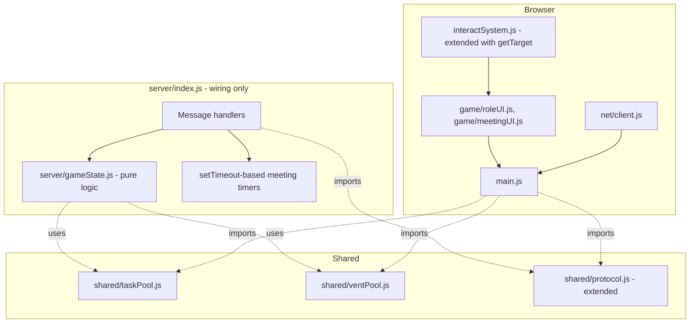

# Core Game Loop Design

**Spec**: `.specs/features/core-game-loop/spec.md`
**Status**: Draft

---

## Research Notes

The Skeld's real vent network groups rooms into closed loops rather than simple pairs. Cross-referencing two independent summaries of the actual game rather than assuming: vents link Reactor with both Upper and Lower Engine; Electrical, MedBay, and Security form a loop; Admin and Cafeteria are linked; Navigation/Weapons/Shields form another cluster; O2, Communications, and Storage have no vents at all. This project's per-room vent model (one vent per room, not per exact in-room vent prop) approximates that as 4 groups covering 11 of the 14 rooms, leaving O2/Communications/Storage vent-less — which happens to match the real map's vent-less rooms exactly.

Sources: [dotesports vent locations](https://dotesports.com/streaming/news/all-among-us-maps-and-vent-locations), [The Skeld — Among Us Wiki](https://among-us.fandom.com/wiki/The_Skeld)

No new external libraries are needed — this feature is built entirely on Milestone 1/2's existing Three.js scene, `interactSystem`, and the relay server/protocol.

---

## Architecture Overview

The relay server gains a new **pure, framework-agnostic game state module** (`server/gameState.js`) that owns role assignment, task tracking, kill/death, meeting/voting, and win-condition logic — deliberately kept free of `ws`/`node:` imports so it can be unit tested directly, unlike `server/index.js`'s connection plumbing. Two new shared static-data modules (`shared/taskPool.js`, `shared/ventPool.js`) are known to both client and server, the same pattern `shared/protocol.js` and `src/map/skeldRooms.js` already established — so the server only ever needs to transmit *ids*, never positions.



**Key simplification (Tech Decision):** a dead player's client keeps running normally (movement, camera) — the server simply stops relaying their `state` messages to other clients once they're marked dead, and broadcasts one `playerDied` so everyone else calls the existing `remotePlayers.remove(id)`. No new client-side "spectator mode" rendering path is needed; "can't be seen, can still walk around" falls out of a single alive-check in the existing relay handler.

---

## Code Reuse Analysis

### Existing Components to Leverage

| Component | Location | How to Use |
| --- | --- | --- |
| `interactSystem.js` | `src/interaction/interactSystem.js` | Extended (not replaced) to also expose which object is currently targeted, so game code can act on E-key press/hold instead of just showing a prompt |
| `remotePlayers.js` | `src/net/remotePlayers.js` | Unchanged — `playerDied` handling just calls its existing `remove(id)` |
| `playerController.js` | `src/player/playerController.js` | Extended with a `setFrozen(bool)` to stop processing input during meetings |
| `net/client.js`, relay server, protocol pattern | Milestone 2 | Every new message type follows the exact same `on(type, handler)`/`send(type, payload)` shape already established |
| `skeldRooms.js` (room centers) | `src/map/skeldRooms.js` | Task/vent locations are placed as offsets from existing room centers, not a new coordinate system |

### Integration Points

| System | Integration Method |
| --- | --- |
| `main.js` (Milestone 2) | Adds: role reveal on `role` message, task HUD wired to `tasksProgress`, meeting overlay wired to `meetingStarted`/`meetingResult`, game-over screen wired to `gameOver` |
| Milestone 2's relay server | `server/index.js` gains new message handlers alongside the existing `join`/`state`/`start` ones — no changes to those |

---

## Components

### Task Pool (`shared/taskPool.js`)

- **Purpose**: Static, framework-agnostic definition of every possible task location (5 for v1).
- **Location**: `shared/taskPool.js`
- **Interfaces**: `TASK_LOCATIONS: { id: string, roomId: string, offset: [number, number, number], label: string }[]`
- **Dependencies**: none
- **Reuses**: room ids match `src/map/skeldRooms.js`'s `ROOM_LAYOUT` ids

### Vent Pool (`shared/ventPool.js`)

- **Purpose**: Static vent locations grouped into teleport loops, plus a pure lookup for "where does this vent lead."
- **Location**: `shared/ventPool.js`
- **Interfaces**:
  - `VENT_LOCATIONS: { id: string, roomId: string, offset: [number, number, number], group: string }[]`
  - `getVentDestination(ventId: string): string | null` — returns the next vent id in the same group (cyclic), or `null` if unknown/solo
- **Dependencies**: none
- **Reuses**: room ids from `skeldRooms.js`

### Game State (`server/gameState.js`)

- **Purpose**: All match rules as pure functions/state — role assignment, task tracking, kills, meetings, voting, win conditions. No I/O, no timers, no sockets — everything time-based (discussion/voting duration) is a parameter, not a `setTimeout` call, so it's fully unit-testable.
- **Location**: `server/gameState.js`
- **Interfaces**:
  - `createMatch(playerIds: string[], randomFn: () => number): MatchState`
  - `getRole(match, playerId): 'impostor' | 'crewmate'`
  - `getAssignedTasks(match, playerId): string[]` (task ids)
  - `completeTask(match, playerId, taskId): { allDone: boolean, completed: number, total: number }`
  - `isAlive(match, playerId): boolean`
  - `recordDeath(match, playerId, cause: 'killed' | 'ejected'): void`
  - `checkWinCondition(match): 'crew' | 'impostor' | null`
  - `startMeeting(match): void` / `endMeeting(match): void` / `match.phase`
  - `castVote(match, voterId, targetId): void` (`targetId` may be the `'skip'` sentinel)
  - `tallyVotes(match): { ejectedId: string | null, wasImpostor: boolean }`
- **Dependencies**: `shared/taskPool.js`
- **Reuses**: none (first server-only game-logic module)

### Server Wiring (`server/index.js`, modified)

- **Purpose**: Adds message handlers for `role`-triggering start, `taskComplete`, `kill`, `callMeeting`, `vote`, `vent`; adds `setTimeout`-driven discussion/voting phase timers; gates `state` relay on `gameState.isAlive`.
- **Location**: `server/index.js`
- **Dependencies**: `server/gameState.js`, `shared/protocol.js`, `shared/ventPool.js`
- **Reuses**: existing connection/broadcast plumbing from Milestone 2

### Interact System (`src/interaction/interactSystem.js`, modified)

- **Purpose**: In addition to the existing look-at prompt, expose the currently-targeted interactable object so game code can react to an E-key press/hold rather than just displaying text.
- **Location**: `src/interaction/interactSystem.js`
- **Interfaces** (added): `InteractSystem.getTarget(): THREE.Object3D | null`
- **Dependencies**: unchanged
- **Reuses**: its own existing raycast — this is an additive interface change, not a rewrite

### Player Controller (`src/player/playerController.js`, modified)

- **Purpose**: Adds a frozen state so meetings can pause movement/mouselook without touching the render loop itself.
- **Location**: `src/player/playerController.js`
- **Interfaces** (added): `PlayerController.setFrozen(frozen: boolean): void`
- **Dependencies**: unchanged
- **Reuses**: existing `update`/`handleKeyDown` etc. — frozen just early-returns from input processing

### Role & Task HUD (`src/game/roleUI.js`)

- **Purpose**: Shows the private role-reveal message, and (for Crewmates) a persistent on-screen task list with live completion state.
- **Location**: `src/game/roleUI.js`
- **Interfaces**: `createRoleUI(): { showRole(role, taskLabels), updateProgress(completed, total), hide() }`
- **Dependencies**: DOM only
- **Reuses**: same plain-DOM-overlay pattern as `pointerLockOverlay.js`/`lobbyScreen.js`

### Task Interaction (`src/game/taskInteraction.js`)

- **Purpose**: Watches `interactSystem.getTarget()`; when it's a task the local player owns and hasn't completed, tracks a hold-duration on the interact key and fires `onComplete(taskId)` at ~2 seconds.
- **Location**: `src/game/taskInteraction.js`
- **Interfaces**: `createTaskInteraction(interactSystem, assignedTaskIds, onComplete): { update(deltaTime, isInteractKeyDown) }`
- **Dependencies**: none beyond `interactSystem`'s target
- **Reuses**: `interactSystem.getTarget()`

### Meeting UI (`src/game/meetingUI.js`)

- **Purpose**: Full-screen overlay for the discussion timer and voting phase; shows the result (ejected player + role reveal, or no ejection).
- **Location**: `src/game/meetingUI.js`
- **Interfaces**: `createMeetingUI({ onVote }): { showDiscussion(seconds), showVoting(livingPlayers, seconds), showResult(ejectedName, wasImpostor), hide() }`
- **Dependencies**: DOM only
- **Reuses**: same plain-DOM-overlay pattern as `lobbyScreen.js`

### Game Over Screen (`src/game/gameOverScreen.js`)

- **Purpose**: Final full-screen message declaring the winner and the Impostor's identity.
- **Location**: `src/game/gameOverScreen.js`
- **Interfaces**: `showGameOver(winner: 'crew' | 'impostor', impostorName: string)`
- **Dependencies**: DOM only
- **Reuses**: same plain-DOM-overlay pattern

---

## Data Models

### Protocol additions (`shared/protocol.js`)

```javascript
// Server -> Client (private, sent only to one player)
{ type: 'role', role: 'impostor' | 'crewmate', taskIds: string[] } // taskIds empty for impostor
{ type: 'teleport', position: [number, number, number] } // vent response, sender only

// Client -> Server
{ type: 'taskComplete', taskId: string }
{ type: 'kill', targetId: string }
{ type: 'callMeeting' }
{ type: 'vote', targetId: string } // 'skip' is a valid targetId value
{ type: 'vent', ventId: string }

// Server -> Client (broadcast)
{ type: 'tasksProgress', completed: number, total: number }
{ type: 'playerDied', id: string, cause: 'killed' | 'ejected' }
{ type: 'meetingStarted', livingPlayers: { id, name }[], discussionSeconds: number, votingSeconds: number }
{ type: 'meetingResult', ejectedId: string | null, wasImpostor: boolean }
{ type: 'gameOver', winner: 'crew' | 'impostor', impostorId: string }
```

### MatchState (server/gameState.js, in-memory only)

```javascript
{
  impostorId: string,
  alive: Set<string>,          // player ids currently alive
  tasksByPlayer: Map<string, { taskId: string, done: boolean }[]>,
  phase: 'playing' | 'meeting' | 'gameOver',
  votes: Map<string, string>,  // voterId -> targetId (cleared each meeting)
}
```

**Relationships**: `tasksByPlayer` keys are Crewmate ids only (the Impostor has no entry, per GAME-01/02). `checkWinCondition` reads `alive` + `impostorId` for parity, and `tasksByPlayer` for the all-done path.

---

## Error Handling Strategy

| Error Scenario | Handling | User Impact |
| --- | --- | --- |
| Dead player sends `taskComplete`/`kill`/`vote`/`callMeeting`/`vent` | Server checks `gameState.isAlive` first, ignores if false | No effect, no error shown (per spec.md edge case) |
| Non-Impostor sends `kill`/`vent` | Server checks `gameState.getRole` first, ignores if not Impostor | No effect |
| `callMeeting`/`kill` while `phase !== 'playing'` | Server checks `match.phase`, ignores | No effect (prevents double meetings) |
| `vote` for an unknown/dead target id | Server validates target is `'skip'` or a currently-alive id, ignores otherwise | Vote not counted |
| Impostor disconnects mid-match | `close` handler checks if the leaving id is the Impostor, immediately ends the match as a Crewmate win | All clients see `gameOver` |
| "Start Game" with < 2 players | Client-side check before sending `start` (server also validates and sends an `error`) | Lobby shows a message instead of starting |

---

## Tech Decisions (only non-obvious ones)

| Decision | Choice | Rationale |
| --- | --- | --- |
| Game rules live in a pure module, not inline in `server/index.js` | `server/gameState.js`, zero I/O | Makes role assignment, task tracking, vote tallying, and win conditions — the actual game rules, and the easiest place to hide a bug — unit-testable, unlike the rest of this networking-heavy project |
| Dead-player invisibility | Server stops relaying their `state`, no client-side spectator mode | The relay-model (AD from Milestone 2) already means clients render whatever `state` they receive; gating relay on alive-status gets "can't be seen" for free |
| Task/vent data location | `shared/*Pool.js`, positions never sent over the wire | Matches the established `protocol.js`/`skeldRooms.js` pattern — server only needs to say *which id*, client already knows where it is |
| Single fixed task-hold duration (~2s), no per-task variation | One constant, not per-task config | No distinct minigames in v1 scope (spec.md's scope-narrowing assumption) — variation would be unused flexibility |
| Vent grouping at room granularity (not per-vent-prop) | 4 groups covering 11/14 rooms, cyclic "next in group" destination | Matches the real Skeld's vent-less rooms (O2/Comms/Storage) closely enough without modeling multiple vent props per room |
