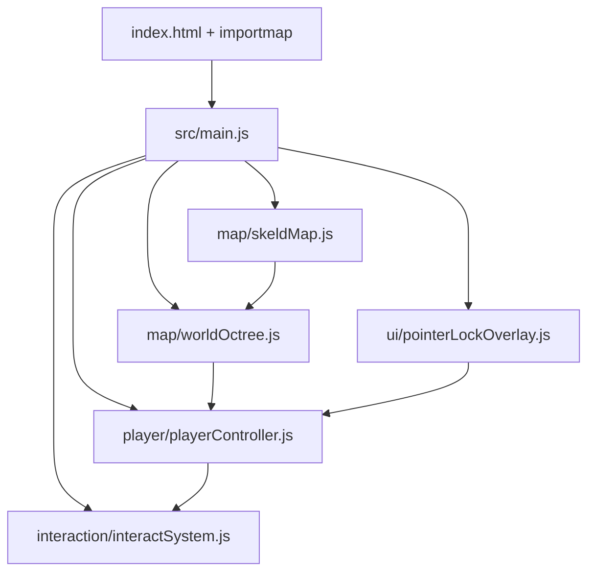

# First-Person Movement Design

**Spec**: `.specs/features/first-person-movement/spec.md`
**Context**: `.specs/features/first-person-movement/context.md`
**Status**: Draft

---

## Research Notes

Verified against the official Three.js repo (`mrdoob/three.js`, `examples/games_fps.html`) rather than assumed:

- Three.js ships an official FPS-collision pattern: `Octree` (`three/addons/math/Octree.js`) + `Capsule` (`three/addons/math/Capsule.js`). `worldOctree.fromGraphNode(someGroupOrScene)` builds a static collision tree from any Three.js `Object3D` graph — it does not require a loaded GLTF model, so procedural box geometry works the same way.
- The official example does **not** use the `PointerLockControls` addon class for its FPS controller — it wires `pointerlockchange`, `mousemove` (using `movementX/movementY`), `keydown`/`keyup` directly, and integrates player physics itself. This gives direct control over pitch clamping, sprint, and head-bob, which the addon doesn't expose. We follow this pattern instead of `PointerLockControls`.
- Player movement is resolved via `playerCollider.translate(...)` then `worldOctree.capsuleIntersect(playerCollider)`, split across several fixed sub-steps per animation frame (`STEPS_PER_FRAME`) for collision stability at any frame rate.
- No build step is needed: the official example itself runs via an `importmap` (`"three"` → `three.module.js`, `"three/addons/"` → `./jsm/`) served as static files, matching AD-003 in STATE.md.

Sources: [PointerLockControls docs](https://threejs.org/docs/pages/PointerLockControls.html), [Octree docs](https://threejs.org/docs/pages/Octree.html), [games_fps.html source](https://github.com/mrdoob/three.js/blob/dev/examples/games_fps.html)

---

## Architecture Overview

Single-page vanilla ES module app. No server/networking in this feature (deferred to Milestone 2). `index.html` loads an importmap pinned to a specific Three.js version via CDN, then `src/main.js` wires everything together and drives the render loop.



Render loop (per animation frame): input → sub-stepped player physics/collision → interact-prompt raycast → render.

---

## Code Reuse Analysis

No existing project code yet (fresh repo). This feature establishes the base structure everything else builds on.

### Existing Components to Leverage

| Component | Location | How to Use |
| --- | --- | --- |
| Three.js `Octree`/`Capsule` (official addon) | `three/addons/math/Octree.js`, `three/addons/math/Capsule.js` | Use directly for world collision and player shape, per `games_fps.html` pattern |
| Three.js core (`Scene`, `PerspectiveCamera`, `WebGLRenderer`) | `three` (CDN) | Standard scene bootstrap |

### Integration Points

| System | Integration Method |
| --- | --- |
| Milestone 2 networking (future) | `playerController` will later expose position/rotation to a network-sync module; not built yet, but state is kept in one place (`playerCollider`, camera) to make that extraction straightforward |
| Milestone 3 game loop (future) | `interactSystem`'s interactable-tagging convention (`mesh.userData.interactable = true`) is the hook tasks/vents/bodies will register against |

---

## Components

### Scene Bootstrap (`src/main.js`)

- **Purpose**: Create renderer/scene/camera, own the animation loop, wire the other modules together.
- **Location**: `src/main.js`
- **Interfaces**: none exported — entry point only, run on `DOMContentLoaded`.
- **Dependencies**: `map/skeldMap.js`, `map/worldOctree.js`, `player/playerController.js`, `ui/pointerLockOverlay.js`, `interaction/interactSystem.js`
- **Reuses**: Three.js `WebGLRenderer`, `PerspectiveCamera`, `Clock`

### Skeld Map Builder (`src/map/skeldMap.js`)

- **Purpose**: Define The Skeld's room layout as data, then build it into a `THREE.Group` of procedural box geometry (floors/walls/ceilings) plus a spawn point.
- **Location**: `src/map/skeldMap.js`
- **Interfaces**:
  - `buildSkeldMap(): { group: THREE.Group, spawnPoint: THREE.Vector3, interactables: THREE.Mesh[] }`
- **Dependencies**: Three.js core geometry/materials
- **Reuses**: none (first component built)

### World Collider (`src/map/worldOctree.js`)

- **Purpose**: Wrap Three.js `Octree` construction so the rest of the app doesn't touch the addon directly.
- **Location**: `src/map/worldOctree.js`
- **Interfaces**:
  - `buildWorldOctree(mapGroup: THREE.Group): Octree`
- **Dependencies**: `three/addons/math/Octree.js`
- **Reuses**: Official `Octree.fromGraphNode()` API

### Movement Math (`src/player/movementMath.js`)

- **Purpose**: Pure functions extracted out of the player controller so the edge-case math (FPM-09 diagonal normalization, pitch clamping) is independently unit-testable, per TESTING.md's "unit tests for pure logic only" convention.
- **Location**: `src/player/movementMath.js`
- **Interfaces**:
  - `normalizeMovementVector(forward: number, right: number): { forward: number, right: number }` — scales a `[-1,1]` input pair so diagonal input never exceeds magnitude 1 (FPM-09)
  - `clampPitch(pitch: number): number` — clamps camera pitch to just under ±90° (FPM-03)
- **Dependencies**: none (pure math, no Three.js/DOM imports)
- **Reuses**: none

### Player Controller (`src/player/playerController.js`)

- **Purpose**: Owns the player `Capsule` collider, camera, movement/physics/collision resolution, sprint, and head-bob; delegates pure math to `movementMath.js`.
- **Location**: `src/player/playerController.js`
- **Interfaces**:
  - `createPlayerController(camera: THREE.PerspectiveCamera, worldOctree: Octree, spawnPoint: THREE.Vector3): PlayerController`
  - `PlayerController.update(deltaTime: number): void` — runs `STEPS_PER_FRAME` physics sub-steps, updates camera position from the capsule, applies head-bob
  - `PlayerController.handleKeyDown/handleKeyUp(event: KeyboardEvent): void`
  - `PlayerController.handleMouseMove(event: MouseEvent): void` — applies yaw/pitch from `movementX/movementY`, using `movementMath.clampPitch`
- **Dependencies**: `three/addons/math/Capsule.js`, `three/addons/math/Octree.js`, `src/player/movementMath.js`
- **Reuses**: `games_fps.html` collision/physics pattern (gravity, damping, capsule-vs-octree, sub-stepping)

### Pointer Lock Overlay (`src/ui/pointerLockOverlay.js`)

- **Purpose**: Show a "click to play" / "click to resume" overlay when pointer lock is inactive; hide it when active. Handles the Esc/focus-loss edge case (FPM-08).
- **Location**: `src/ui/pointerLockOverlay.js`
- **Interfaces**:
  - `initPointerLockOverlay(domElement: HTMLElement): { onLockChange: () => void }`
- **Dependencies**: `document.pointerlockchange` event, `requestPointerLock()`
- **Reuses**: none

### Interact System (`src/interaction/interactSystem.js`)

- **Purpose**: Raycast from screen center against meshes tagged `userData.interactable`; show/hide the crosshair prompt within range (FPM-07). No action fires yet — this is the placeholder hook Milestone 3 wires real actions into.
- **Location**: `src/interaction/interactSystem.js`
- **Interfaces**:
  - `createInteractSystem(camera: THREE.PerspectiveCamera, interactables: THREE.Mesh[]): { update: () => void }`
- **Dependencies**: `THREE.Raycaster`
- **Reuses**: none

---

## Data Models

### RoomDef (map layout data, not a runtime class)

```javascript
// src/map/skeldRooms.js
{
  id: 'cafeteria',        // matches The Skeld room names
  center: [0, 0, 0],      // world position (x, y, z)
  size: [12, 3, 12],      // width, height, depth
  connections: ['admin', 'weapons', 'storage', 'upperEngine'] // adjacent room ids (used to place corridor geometry)
}
```

**Relationships**: `connections` between `RoomDef` entries drive corridor placement between two rooms' nearest walls. The full `ROOM_LAYOUT` array covers the rooms named in context.md (Cafeteria, Weapons, Navigation, O2, Shields, Communications, Storage, Electrical, Upper/Lower Engine, Security, Reactor, Medbay, Admin).

### InteractableDef

```javascript
{
  mesh: THREE.Mesh,   // userData.interactable = true
  range: 3,           // meters, world units
  label: 'placeholder' // shown in the prompt, not wired to an action yet
}
```

---

## Error Handling Strategy

| Error Scenario | Handling | User Impact |
| --- | --- | --- |
| Browser lacks WebGL support | `WebGLRenderer` construction throws / `renderer.getContext()` is null | Show a plain-text fallback message instead of a blank page |
| Pointer lock request rejected/exited (Esc, alt-tab) | `document.addEventListener('pointerlockchange', ...)` | Overlay reappears (FPM-08); movement/mouselook pauses until re-clicked |
| Window resized | `window.addEventListener('resize', ...)` updates camera aspect + renderer size | No visual distortion (FPM-10) |

---

## Extensibility Considerations

The user asked for this to be built for easy maintenance/extension later, so the module boundaries above are drawn along the seams Milestone 2 and 3 will actually cut along — without building any unused abstraction now:

- **One module, one concern.** `map`, `player`, `ui`, `interaction` don't import each other's internals — `main.js` wires them via plain function returns/params. Adding networking later means adding a `src/net/` module that `main.js` wires in the same way, not touching existing modules' internals.
- **State lives in one place per concern.** Player position/rotation lives only in `playerController`'s capsule + camera — nothing duplicates it. This is the exact value Milestone 2 will need to serialize and broadcast, so there's a single, obvious read point instead of scattered state.
- **Interactable tagging is the extension point for Milestone 3.** `mesh.userData.interactable = true` (plus an `InteractableDef`) is the whole contract. Tasks/vents/bodies in Milestone 3 register more `InteractableDef`s against the same `interactSystem` — no changes needed to the raycast/prompt logic itself.
- **Map data is separate from map building.** `skeldRooms.js` (data) vs `skeldMap.js` (geometry construction) means swapping in a different layout, or later adding per-room metadata (e.g. "this room has a task spawn point"), only touches the data file.
- **No speculative code for Milestone 2/3 features is written now** — e.g. no empty `net/` folder, no unused `TaskDef` types. The seams above are just naming/boundary discipline in code that already has to exist for this feature; nothing is added that isn't used yet.

---

## Tech Decisions (only non-obvious ones)

| Decision | Choice | Rationale |
| --- | --- | --- |
| Collision system | Three.js official `Octree` + `Capsule` (addons) | Battle-tested pattern from Three.js's own FPS example; avoids hand-rolling AABB/sphere collision |
| Mouselook implementation | Manual `movementX/movementY` handling, not the `PointerLockControls` addon class | Need direct pitch clamp + head-bob integration; the addon's `PointerLockControls` wraps this less flexibly |
| Map geometry | Procedural `THREE.BoxGeometry` per room/corridor, no GLTF model | No art assets in v1 scope (PROJECT.md); Octree works on procedural geometry the same as a loaded model |
| Room layout source | Static `ROOM_LAYOUT` data module (`skeldRooms.js`) | Matches context.md's "recreate The Skeld" decision while keeping map data separate from map-building/rendering code |
| Three.js delivery | CDN `importmap` pinned to one version, no bundler | Matches AD-003 (no client build step) |
