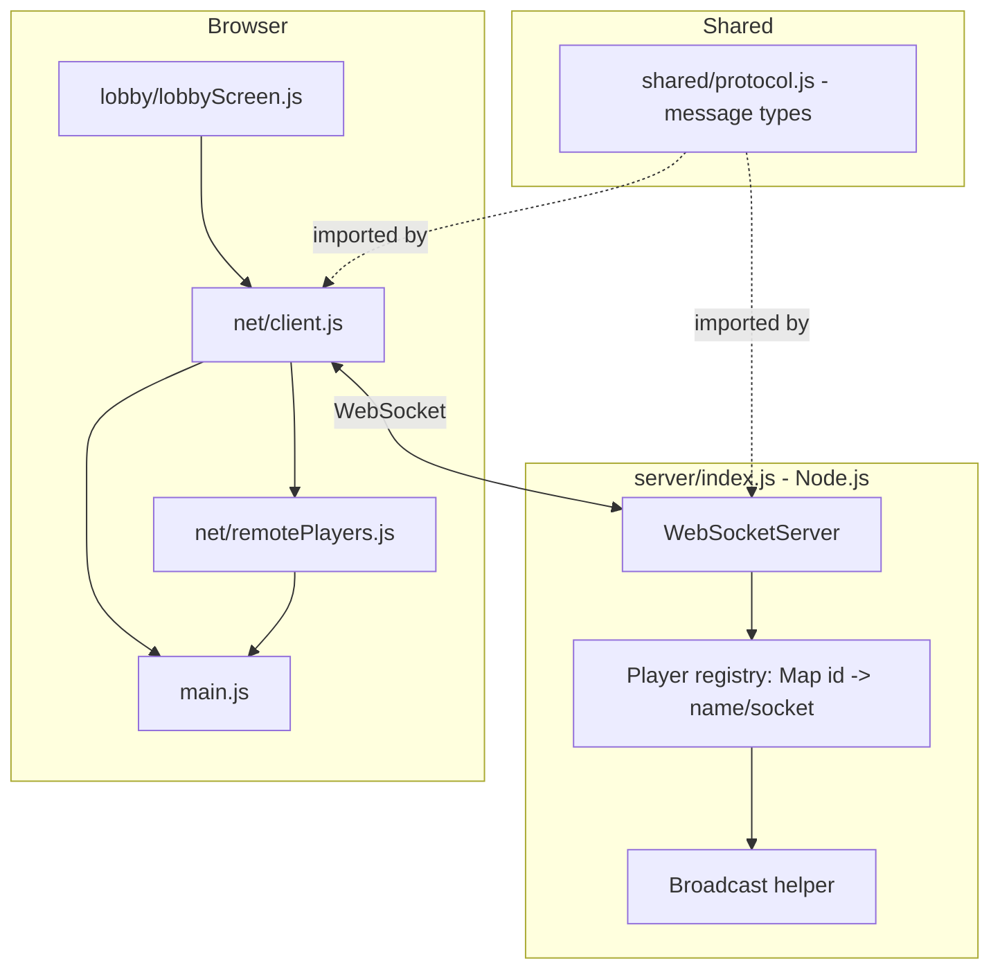

# Local Multiplayer Foundation Design

**Spec**: `.specs/features/local-multiplayer/spec.md`
**Status**: Draft

---

## Research Notes

Verified against `ws`'s own README/npm page and the current Three.js addon docs rather than assumed:

- `ws` (npm, currently 8.21.1) is the de facto Node.js WebSocket library — Node has no built-in WebSocket *server* (only an experimental client `WebSocket` global). Minimal server shape: `new WebSocketServer({ port })`, then `wss.on('connection', socket => ...)`, `socket.on('message', ...)`, `socket.on('close', ...)`, broadcasting by iterating `wss.clients` and checking `client.readyState === WebSocket.OPEN`.
- Browsers ship a native `WebSocket` global — the client needs no library, just `new WebSocket('ws://host:port')` plus `.onopen/.onmessage/.onclose/.send()`.
- Three.js ships `CSS2DRenderer`/`CSS2DObject` (`three/addons/renderers/CSS2DRenderer.js`) specifically for attaching HTML labels (e.g. name tags) to 3D positions — it's a second renderer that must be sized/positioned like the WebGL canvas and given its own `render(scene, camera)` call each frame, with `CSS2DObject`s added to the scene graph like any other `Object3D`.

Sources: [ws npm package](https://www.npmjs.com/package/ws), [CSS2DObject docs](https://threejs.org/docs/pages/CSS2DObject.html), [CSS2DRenderer docs](https://threejs.org/docs/#examples/en/renderers/CSS2DRenderer)

**Scope decision carried over from spec.md's Problem Statement:** the server is a trusted relay, not an authoritative physics simulator — each client still runs its own `playerController`/collision locally (from Milestone 1) and just broadcasts the result.

---

## Architecture Overview

A Node.js relay server (new, server-side only — the first server-side code in this project) and three new client modules that plug into `main.js` without modifying Milestone 1's `map`/`player`/`ui`/`interaction` modules. A `shared/protocol.js` file (plain ESM, no Node- or browser-specific APIs) is imported by **both** the server and the client so the message shape can't drift between them.



Render loop addition: each frame, `main.js` now also (a) sends the local player's state at a throttled rate via `NetClient`, and (b) calls `remotePlayers.update(deltaTime)` to interpolate and render every other player's avatar + name label.

---

## Code Reuse Analysis

### Existing Components to Leverage

| Component | Location | How to Use |
| --- | --- | --- |
| `playerController` | `src/player/playerController.js` | Unchanged — remains the sole source of the local player's position/rotation; `main.js` reads its camera position/yaw each frame to build the outgoing state message |
| Three.js core (`Group`, `CapsuleGeometry`, materials) | `three` (CDN) | Reused for remote-player placeholder avatars, same style as `skeldMap.js`'s primitive geometry |
| `three/addons/renderers/CSS2DRenderer.js` | CDN addon | New addition, used only for name-tag labels |

### Integration Points

| System | Integration Method |
| --- | --- |
| `main.js` (Milestone 1) | Adds: import + wire `lobbyScreen`, `netClient`, `remotePlayers`; the 3D scene/animate loop only starts after the lobby's "start" event fires (previously it started immediately on page load) |
| Milestone 3 (future) | The same `shared/protocol.js` + relay server gain new message types (task progress, kill, meeting/vote) without changing how the relay itself works — it already just relays typed JSON messages to everyone else |

---

## Components

### Message Protocol (`shared/protocol.js`)

- **Purpose**: Single source of truth for every WebSocket message shape, imported by both server and client so they can't drift apart.
- **Location**: `shared/protocol.js` (plain ESM, framework-agnostic — no `node:` or DOM imports)
- **Interfaces**:
  - `MESSAGE_TYPE` — object of string constants: `JOIN`, `WELCOME`, `PLAYER_JOINED`, `PLAYER_LEFT`, `STATE`, `START`, `ERROR`
  - `isKnownMessageType(type: string): boolean` — pure validation used by both sides before trusting a parsed JSON message (network input is a trust boundary)
- **Dependencies**: none
- **Reuses**: none (first shared module)

### Relay Server (`server/index.js`)

- **Purpose**: Accept WebSocket connections, track connected players, relay `state` messages, broadcast join/leave/start events, log the LAN IP:port on startup.
- **Location**: `server/index.js`
- **Interfaces**: none exported — run directly via `node server/index.js` (or `npm run server`)
- **Dependencies**: `ws` (npm), `node:os` (for LAN IP discovery), `shared/protocol.js`
- **Reuses**: none

### Net Client (`src/net/client.js`)

- **Purpose**: Thin wrapper around the browser's native `WebSocket`, translating typed protocol messages to/from plain callbacks so the rest of the client never touches raw JSON.
- **Location**: `src/net/client.js`
- **Interfaces**:
  - `createNetClient(url: string): NetClient`
  - `NetClient.on(type: string, handler: (payload) => void): void`
  - `NetClient.send(type: string, payload: object): void`
  - `NetClient.close(): void`
- **Dependencies**: browser `WebSocket`, `shared/protocol.js`
- **Reuses**: none

### Lobby Screen (`src/lobby/lobbyScreen.js`)

- **Purpose**: DOM-based join/lobby UI — host-vs-join choice, name entry, live player list, host-only "Start Game" button, connection-failure message.
- **Location**: `src/lobby/lobbyScreen.js`
- **Interfaces**:
  - `showLobby({ onHostAndJoin, onJoin, onStart }): LobbyHandle`
  - `LobbyHandle.setPlayers(players: {id, name}[]): void`
  - `LobbyHandle.setIsHost(isHost: boolean): void`
  - `LobbyHandle.showConnectionError(message: string): void`
  - `LobbyHandle.hide(): void`
- **Dependencies**: DOM only
- **Reuses**: same plain-DOM-overlay pattern as `ui/pointerLockOverlay.js`

### Remote Players (`src/net/remotePlayers.js`)

- **Purpose**: Own the set of other players' placeholder avatars (capsule mesh + `CSS2DObject` name label), applying interpolation between received state updates instead of snapping.
- **Location**: `src/net/remotePlayers.js`
- **Interfaces**:
  - `createRemotePlayers(scene: THREE.Scene, labelRenderer): RemotePlayers`
  - `RemotePlayers.upsert(id, name, position, rotationY, seq): void` — called on every incoming `state`/`playerJoined` message
  - `RemotePlayers.remove(id): void` — called on `playerLeft`
  - `RemotePlayers.update(deltaTime): void` — advances interpolation, called once per animation frame
- **Dependencies**: `three/addons/renderers/CSS2DRenderer.js`
- **Reuses**: primitive-geometry style from `skeldMap.js`

---

## Data Models

### Protocol messages (`shared/protocol.js` constants + shapes, JSON over the wire)

```javascript
// Client -> Server
{ type: 'join', name: string }
{ type: 'state', position: [number, number, number], rotationY: number, seq: number }
{ type: 'start' } // only honored by the server if sender is the current host

// Server -> Client
{ type: 'welcome', playerId: string, isHost: boolean, players: { id: string, name: string }[] }
{ type: 'playerJoined', id: string, name: string }
{ type: 'playerLeft', id: string }
{ type: 'state', id: string, position: [number, number, number], rotationY: number, seq: number }
{ type: 'start' }
{ type: 'error', message: string }
```

**Relationships**: `seq` is a monotonically increasing integer the sending client attaches to its own `state` messages; `remotePlayers.upsert` drops any update whose `seq` is not greater than the last one applied for that `id` (NET-12).

---

## Error Handling Strategy

| Error Scenario | Handling | User Impact |
| --- | --- | --- |
| Client can't reach host IP:port | `WebSocket.onerror`/`onclose` before `onopen` fires within a short timeout | Lobby shows "Couldn't connect — check the address and try again" (NET-10) |
| Duplicate display name | Server appends a numeric suffix before sending `welcome`/`playerJoined` | Player sees their own (possibly suffixed) name reflected in the lobby list (NET-08) |
| Non-host sends `start` | Server checks sender id against the tracked host id and ignores the message | No visible effect for that player; host's button remains the only way to start |
| Player disconnects mid-match | `socket.on('close')` removes them from the registry and broadcasts `playerLeft` | Other clients remove that avatar (NET-05, NET-13) |

---

## Tech Decisions (only non-obvious ones)

| Decision | Choice | Rationale |
| --- | --- | --- |
| Authority model | Relay, not authoritative simulation | Explicit scope call in spec.md's Problem Statement — LAN-trusted, no anti-cheat requirement (PROJECT.md) |
| Host designation | First client to connect is the host | No lobby "room owner" election UI needed; matches the natural flow of "whoever started the server opens their browser first" |
| Server dependency management | Root `package.json` with `ws` as the only dependency, `npm install` once | AD-003 ("no client build step") is about the *browser* client staying bundler-free — it doesn't extend to the Node-only server, which has no browser-facing build step either way |
| Shared protocol module | One `shared/protocol.js` imported by both server (Node ESM) and client (browser ESM via relative path) | Prevents the message-shape drift that would otherwise require hand-keeping two copies in sync — directly serves the AD-005 maintainability decision |
| Remote player identification | Placeholder capsule + `CSS2DObject` name label, no per-player custom model | No art assets in scope (PROJECT.md); reuses the primitive-geometry approach already established in `skeldMap.js` |
| Client send rate | Throttled (not every animation frame) | Reduces LAN chatter; exact rate is an implementation constant tuned during Execute, not a spec-level decision |
